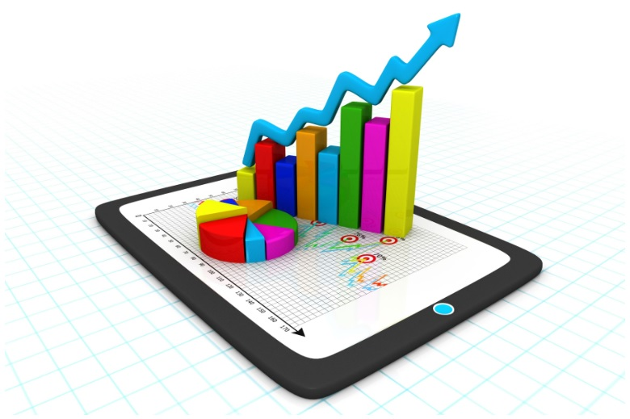
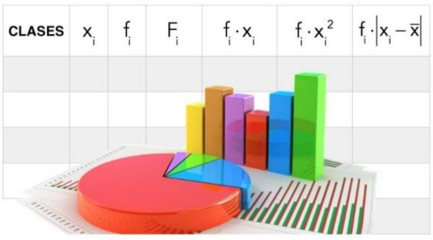
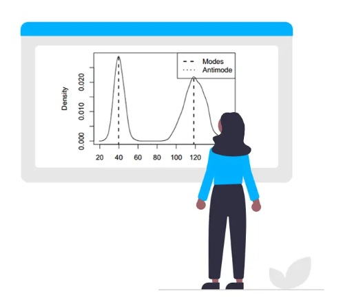

```{r setup, include=FALSE}
library(flexdashboard)
library(paqueteMET)                # activar paqueteMET
data("CarreraLuz22")               # cargar la dataset
library(dplyr)  
library(lubridate)  
library(ggplot2) 
library(plotrix)
```

# Base de Datos {data-icon=fa-database}
Columns 1 {data-width=200}
--------------------------------------------------------------------------------
### **BASE DE DATOS UTILIZADA**

Para el desarrollo de esta actividad se utilizó la base de datos “CarreraLuz2022”, contenida en el paquete “paqueteMET” es el registro de datos de una de las carreras más tradicionales de Cali.
La idea con esta carrera es que las personas puedan aportar, donar al momento de hacer la inscripción para realizar obras de inversión social 
Se llama la carrera de la Luz porque se realiza en el mes de diciembre.


Columns 2  {.tabset .tabset-fade}
--------------------------------------------------------------------------------

### **CarreraLuz22**  

```{r}
mi_df <- data.frame(CarreraLuz22)
mi_df
```

# Indicadores {data-orientation=columns, data-icon=fa-flag-checkered} 

Columns 1 {data-width=200}
--------------------------------------------------------------------------------
### **INDICADORES ESTADISTICOS   (Variables Cuantitativas)**
INDICADOR ESTADÍSTICO Es el dato numérico, resultado de un proceso que cuantifica científicamente una característica de una muestra. “Es el elemento característico que describe una situación permitiendo su análisis”.Para el ejemplo la muestra tomada fue la edad de los participantes.



Columns 2  {.tabset .tabset-fade}
--------------------------------------------------------------------------------

### **INDICADORES DE CENTRO** 
**Media**
```{r}
round(mean(CarreraLuz22$edad, na.rm = TRUE),2)
```
La media (promedio) de un conjunto de datos se encuentra al sumar todos los números en el conjunto de datos y luego al dividir entre el número de valores en el conjunto, para este caso 37 años es la edad promedio

**Mediana**
```{r}
median(CarreraLuz22$edad, na.rm = TRUE)
```
La mediana es el valor medio cuando un conjunto de datos se ordena de menor a mayor, el valor medio para el ejemplo es 36

**Moda**
```{r}
library(modeest)
mfv(CarreraLuz22$edad) #Indica el o los valores con más frecuencia
```
La edad que más se repite es 31 años

### **INDICADORES DE DISPERSION**
**Rango**
```{r}
#Valores mínimo y máximo
range(CarreraLuz22$edad, na.rm = TRUE)
```
La edad mínima y máxima de los competidores es 15 y 76 años respectivamante

**Varianza**
```{r}
round(var(CarreraLuz22$edad, na.rm = TRUE),2)
```
La varianza es una medida de dispersión que representa la variabilidad de una serie de datos respecto a su media

**Desviación Estándar**

```{r}
round(sd(CarreraLuz22$edad, na.rm = TRUE),2)
```
La desviación estándar mide la dispersión de una distribución de datos. Entre más dispersa está una distribución de datos, más grande es su desviación estándar.

**coeficiente de variación**

```{r}
#Asegurarse de ejecutar previamente el comando "install.packages("FinCal")"
#install.packages("FinCal")
library(FinCal)
round(coefficient.variation(sd=sd(CarreraLuz22$edad), avg = mean(CarreraLuz22$edad)),2)
```
En estadística, cuando se desea hacer referencia a la relación entre el tamaño de la media y la variabilidad de la variable, se utiliza el coeficiente de variación

### **INDICADORES DE POSICION**

**Q1 percentil 25**
```{r}
prob = c(0.25)
quantile(CarreraLuz22$edad,prob, na.rm = TRUE)
```
El 25% de los competidores tiene 30 años de edad o menos.

**Q2 percentil 50**
```{r}
prob = c(0.5)
quantile(CarreraLuz22$edad,prob, na.rm = TRUE)

```
El 50% de los competidores tiene 36 años de edad o menos.

**Q3 percentil 75**

```{r}
prob = c(0.75)
quantile(CarreraLuz22$edad,prob, na.rm = TRUE)
```
El 75% de los competidores tiene 44 años de edad o menos.

### **INDICADORES DE FORMA**

**Coeficiente de Asimetría**
```{r}
library(psych)
round(skew(CarreraLuz22$edad),2)
```
Caracteriza el grado de asimetría de una distribución con respecto a su media. La asimetría positiva indica una distribución unilateral que se extiende hacia valores más positivos

**Coeficiente de Curtosis**
```{r}
round(kurtosi(CarreraLuz22$edad),2)
```
Es una medida del grado de cuántos valores atípicos hay, Una curtosis positiva indica que los datos muestran más valores atípico extremos que una distribución normal.

# Tablas  {data-icon=fa-table}
Columns 1 {data-width=200}
--------------------------------------------------------------------------------
### **TABLAS DE FRECUENCIA   (Variables Cualitativas)**

Una tabla de frecuencias muestra de forma ordenada un conjunto de datos estadísticos y a cada uno de ellos le asigna una frecuencia que, en pocas palabras, son las veces que se repite un número o dato.

Para el ejemplo se tuvo en cuenta el análisis a las siguientes categorías de participantes: JUVENIL, ABIERTA, VETERANOS A, VETERANOS B, VETERANOS C



Columns 2  {.tabset .tabset-fade}
--------------------------------------------------------------------------------

### **FRECUENCIAS** 
**Frecuencias Absolutas**
```{r}
tabla <- table(CarreraLuz22$categoria)
tabla
```

**Frecuencias Absolutas Acumuladas **
```{r}
tabla <- table(CarreraLuz22$categoria)
cumsum(tabla)
```

**Frecuencias Relativas**
```{r}
tabla <- table(CarreraLuz22$categoria)
round((prop.table(tabla)),2)
```

**Frecuencias Relativas Acumuladas **
```{r}
tabla <- table(CarreraLuz22$categoria)
round(cumsum(prop.table(tabla)),2)
```


**Frecuencias Relativas (Porcentajes)**
```{r}
tabla <- table(CarreraLuz22$categoria)
round((prop.table(tabla)*100),2)
```

**Frecuencias Relativas Acumuladas (Porcentajes) **
```{r}
tabla <- table(CarreraLuz22$categoria)
round(cumsum(prop.table(tabla)*100),2)
```
# Gráficos  {data-icon=fa-chart-pie}
Columns 1 {data-width=200}
--------------------------------------------------------------------------------
### **GRAFICOS ESTADISTICOS**
Los gráficos estadísticos son las distintas maneras de representar series de datos estadísticos de diverso tipo y origen para mostrar de manera visual cómo evoluciona una o más variables en comparación con otras. En estadística, los diagramas son muy útiles porque permiten extraer conclusiones de un conjunto de datos sin necesidad de hacer cálculos.



```{r}

```

Columns 2  {.tabset .tabset-fade}
--------------------------------------------------------------------------------

### **DIAGRAMA DE BARRAS APILADAS**  
```{r}
tabla <- table(CarreraLuz22$sex, CarreraLuz22$categoria)
barplot(tabla,  main = "Género por categoría",
     xlab = "Categoría", ylab = "Proporción", 
     col = c("royalblue", "green"))
legend(x = "topright", legend = c("Hombre", "Mujer"), fill = c("royalblue", "green"), 
       title = "Género")

```

### **DIAGRAMA DE DISPERCION**

```{r}
plot(x = CarreraLuz22$edad, y = CarreraLuz22$timerun/60, main = "Tiempo empleado por edad", xlab = "Edad (años)", ylab = "Tiempo (min)")
```

### **DIAGRAMA DE CAJA**

```{r}
boxplot(x = CarreraLuz22$edad, main = "Distribución de las edades", ylab = "Edad (años)",col ="yellow")
```

### **HISTOGRAMA Y CURVA DE DENSIDAD**

```{r}
set.seed(seed = 1L)

m <- mean(CarreraLuz22$edad, na.rm = TRUE)
s <- round(sd(CarreraLuz22$edad, na.rm = TRUE),2)


x <- rnorm(n = 1e3L,
           mean =m,
           sd =s)

hist(x = x,
     probability = TRUE,
     ylim = c(0, 0.04))


curve(expr = dnorm(x = x,
                   mean = m,
                   sd = s),
      col = "red",
      lty = 1,
      lwd = 2,
      add = TRUE)
```

### **DIAGRAMA DE BARRAS**
```{r}
tabla <- table(CarreraLuz22$categoria)
barp <- barplot(tabla, xlab='Categoría',ylab='Frecuencia', main="Frecuencia absoluta",col=rainbow(10))
#text(barp, tabla + 0, labels = tabla)
```

### **DIAGRAMA DE DENSIDAD**
```{r}
density2 <- density(CarreraLuz22$edad) 
plot(density2)
polygon(density2, col="red", border="black")
```

### **DIAGRAMA CIRCULAR**
```{r}
#library(plotrix)
pieval<- table(CarreraLuz22$categoria)
 bisectors<-pie3D(pieval,explode=0.1,main="No. de participantes por categoría")
 pielabels<- table(CarreraLuz22$categoria)
pie3D.labels(bisectors,labels=pielabels)
```

